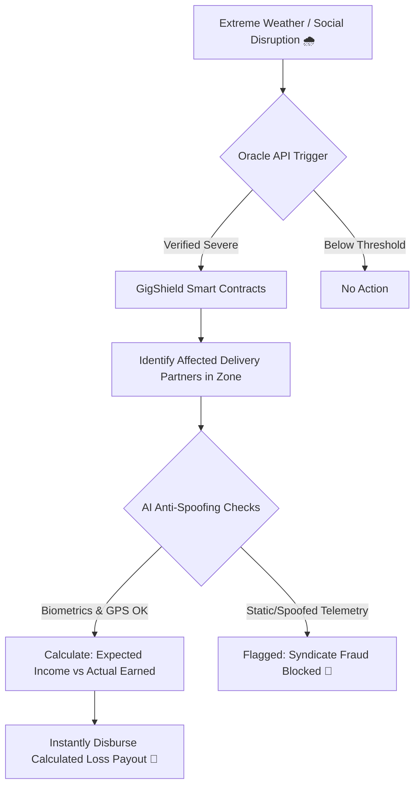
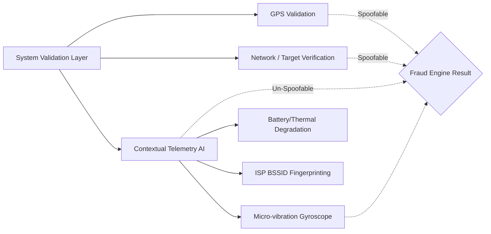

  
  <h1>🛡️ GigShield AI</h1>
  
<strong>AI-Powered Parametric Insurance for India’s Gig Economy</strong>

  
<em>Phase 1: Ideation & Foundation Submission</em>

---

## 📖 1. The Idea & Core Problem Strategy

India's platform-based delivery partners (Zomato, Swiggy, Zepto) are out in the open, fully exposed to elements they cannot control. A sudden 90mm torrential downpour, a severe AQI smog, or an unplanned local curfew instantly destroys their ability to work, resulting in a **20–30% loss of expected daily income**. 
Currently, they bear this loss entirely, with zero health or vehicle coverage offering them income relief. 

**GigShield AI** is a parametric insurance platform designed exclusively to monitor these uncontrollable external disruptions and **instantly reimburse lost wages**.

### 🎯 Persona Focus & Workflow Scenarios
- **Our Target Persona:** Food & Q-Commerce Delivery Partners (e.g., Zomato, Swiggy, Zepto/Blinkit).
- **The Core Scenario:** A Zomato partner in Mumbai is scheduled and expects to make ₹500 on a Friday evening. A sudden torrential downpour completely halts the city grid. The partner is stranded and only makes ₹200.
**GigShield** continuously monitors local weather triggers. When the disruption occurs, it instantly calculates the expected ₹500 vs the actual ₹200 earned, and **automatically pays out the ₹300 difference** to their wallet—no claims adjusters, no paperwork.

---

## ⚙️ 2. The GigShield Workflow Architecture

Below is the automated, zero-friction parametric insurance workflow built into the GigShield system.

---

## 📅 3. Weekly Premium Pricing Model & Triggers

Gig workers operate and are paid week-to-week via their platform apps. Thus, our financial model strictly avoids heavy annual premiums in favor of micro-deductions.

| Plan Tier | Cost (Weekly) | Max Financial Coverage | Max Claims / Week | Target Worker Profile |
|-----------|---------------|------------------------|-------------------|-----------------------|
| **Basic** | ₹10/wk        | ₹300                   | 1                 | Part-time Rider       |
| **Pro**   | ₹25/wk        | ₹800                   | 2                 | Regular Weekly Rider  |
| **Elite** | ₹40/wk        | ₹1500                  | 3                 | Full-time Dedicated   |

### ⚡ Defined Parametric Triggers (Income Loss Only)
1. **Environmental:** Heavy Rain / Floods / High AQI (Hazardous air where riding is impossible).
2. **Social/Systemic:** Unplanned localized curfews or sudden App/Server Crashes (e.g., delivery platform goes down for 3 hours on a weekend).

### 📱 Web vs. Mobile Platform Justification
We built GigShield exclusively as a **Mobile-First Progressive Web Application (PWA)**. 
*Why?* Gig workers shouldn't need perfectly high-end phones with vast storage to download another heavy native app just to manage micro-insurance. A lightweight, browser-based web dashboard ensures zero friction, taking up zero storage, with maximum accessibility across all lower-end Android devices.

---

## 🧠 4. AI/ML Integration Strategy

Our AI engine governs the two most critical nodes of the insurance lifecycle to ensure long-term platform liquidity:

### A. Dynamic Risk Assessment & Premium Calculation
Our ML model assesses historical geographical data (e.g., frequency of monsoons in Mumbai vs gridlock in Bangalore) and assigns a dynamic `0.0` - `1.0` **Location Risk Score** to the worker's zone, mathematically adjusting their localized premium to protect the payout pool from heavy geographic biases.

### B. Intelligent Fraud Detection (Adversarial Defense)
**The Crisis:** A syndicate of 500 delivery workers spoofing their GPS from home to trigger a mass weather payout.
**The AI Solution:** Standard systems only read coordinates. Our AI model utilizes **Multi-Layered Contextual Telemetry**. 

If a spoofer fakes their GPS from their living room couch, their device's biomechanical telemetry (gyroscope) is perfectly static compared to a working driver navigating a storm. Our backend flags the static footprint, realizes it's a spoofer despite the "valid" GPS, and instantly blocks the claim. 

---

## 🧰 5. Tech Stack & 6-Week Dev Plan

### Technology Stack
- **Frontend UI:** React.js, Vite, Tailwind CSS (Glassmorphism), Lucide Icons.
- **Backend Architecture:** Node.js, Express.js.
- **Database:** MongoDB Atlas (Cloud) storing immutable Claim Logs and Policies.

### The 6-Week Roadmap
- **📍 Phase 1 (Weeks 1-2): [Current]** Ideation, Persona Research, Architecture Foundation, and UI Prototypes. Completed the anti-spoofing backend Logic Engine.
- **📍 Phase 2 (Weeks 3-4):** Integration of external live Oracle APIs (Weather/Traffic Map integrations) and training the risk-assessment predictive models.
- **📍 Phase 3 (Weeks 5-6):** Hardening smart contracts, security testing across simulated server loads, and final hackathon presentation polish.
