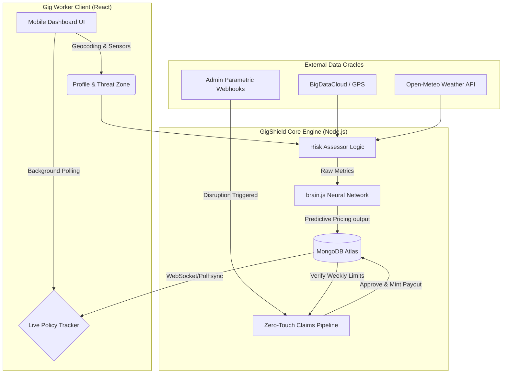

<div align="center">
  
  
  
  
</div>

<br/>

# 🛡️ GigShield AI 
### *Theme: "Protect Your Worker" (Hackathon Phase 2 Deliverable)*

**GigShield AI** is an intelligent, hyper-localized, parametric micro-insurance platform designed explicitly for vulnerable gig workers (delivery partners, drivers, logistics personnel). By blending location-based metrics, live weather APIs, and advanced Machine Learning logic, we replace the archaic "File a Claim" paperwork process with a magical **"Zero-Touch" automated liquidity system**.

When a worker's shift is forcefully interrupted by environmental hazards (heavy rain, extreme heat) or platform failures—GigShield instantly detects the variance and wires their approved claim straight to their balance organically behind the scenes.

---

## 🏗️ Technical Architecture & Ecosystem



---

## 🚀 Core Deliverables & Workflows

### 1. 📝 Frictionless Registration Process
Workers sign up by providing their exact Operating City, Primary Platform (Zomato, Swiggy, Uber), and highly specific **Threat Zones** (e.g., *Flood Prone (Dharavi)* vs. *Historically Safe High-Ground*).
* **Location Risk Profiling:** The platform dynamically cross-references the worker's home zone, logging baseline threat levels directly into the system database during onboarding.

### 2. 🛡️ Insurance Policy Management
The traditional concept of a "yearly premium" is useless to gig workers. We built a granular, hyper-flexible **Weekly Subscription Model**.
* **Tiers:** Basic (₹300 coverage), Pro (₹800 coverage), Elite (₹1,500 coverage).
* **Constraints Engine:** To permanently prevent system abuse, policies are protected by a strict **24-hour Fraud Lock** upon initial subscription, and enforce mathematically verified **Max Weekly Claim Limits**.

### 3. 🧠 Dynamic Premium Calculation (AI Integration)
GigShield abandons static pricing matrices in favor of **Machine Learning models**. 
* **The Architecture:** We integrated `Brain.js` into our backend `mlEngine.js`. 
* **The Logic:** The Neural Net processes historic claim densities, categorical hazard zones (Safe vs. Severe), and live environmental metrics (rainfall, wind speeds) via `Open-Meteo`. 
* **The Outcome:** If a worker shifts their operations into a "Safe / High Ground" area during active monsoon season, the Neural Network dynamically recalculates the base premium to be remarkably cheaper (e.g., dropping from ₹57/wk to ₹12/wk) due to significantly reduced exposure probability.

### 4. ⚡ Seamless Zero-Touch Claim Process
The crown jewel of GigShield AI is the absolute eradication of paperwork. We engineered **Parametric Disruption Oracles (Mock API Webhooks)** on the Admin panel.
* When the Admin system natively detects a spike in disruptions (e.g., *Curfew Imposed* in Mangalagiri or *Heavy Rain* in Mumbai), it broadcasts a silent network trigger.
* **The Workflow:** The algorithmic pipeline scans the affected geographic radius, isolates all workers mathematically exposed during their working shift, verifies they haven't exhausted their coverage limits, and organically generates the claim packet.
* **The Worker Experience:** By implementing a background 4-second polling engine on the frontend `Dashboard.jsx`, the Gig Worker is unexpectedly greeted by a beautiful UI slide-in declaring: **"✅ Zero-Touch Check Passed"**. Funds immediately appear on their screen without a single button click.

---

## 📸 Platform Capabilities 
*(Insert your own local visual artifacts in this section)*

- **Worker Dashboard:** Real-time metrics display integrating GPS history, localized Risk Scoring (0-100%), and active policy trackers gracefully synced with MongoDB.
- **Plan Selection UI:** Transparent visual layout of the dynamic premium calculations categorized by weekly claim limits.
- **Admin Command Center:** System overview showing total ecosystem payouts, volume tracking mapped across 7 days, and interactive Parametric Trigger mock buttons.

---

## 💻 Tech Stack & Deployment Specs
- **Frontend Layer:** `React.js`, `Vite`, `TailwindCSS` (Utility-first styling), `Framer Motion` (Micro-interaction animations), and `anime.js`.
- **Backend Layer:** `Node.js`, `Express.js`.
- **Database Architecture:** `MongoDB Atlas` mapped with strict `Mongoose` schema validations.
- **Security:** Fully implemented modern architecture utilizing `bcryptjs` (handling $2b$ and $2a$ encryption hashing flexibly) and `JSON Web Tokens (JWT)`.

## ⚙️ Running Locally
1. **Prerequisites:** Ensure you have Node v18+ and a MongoDB Cluster URI.
2. **Backend:**
```bash
cd backend
npm install
# Add your MONGODB_URI to backend/.env
npm start 
```
3. **Frontend:**
```bash
cd frontend
npm install
npm run dev
```
