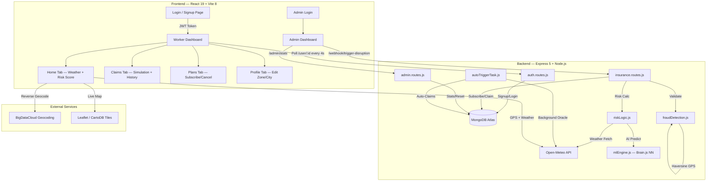
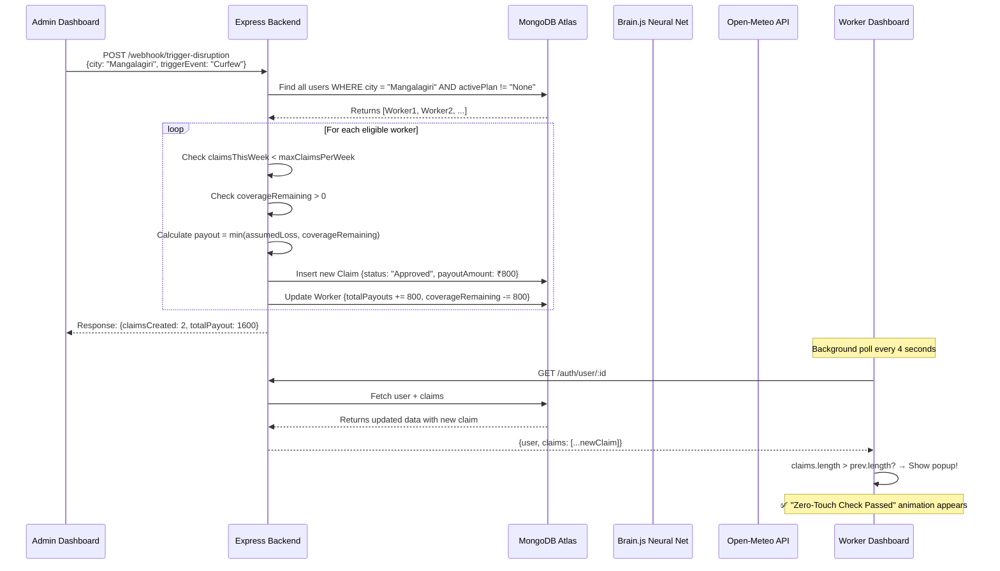

<div align="center">
  
  
  
  
  
  
  
  <br/><br/>
  
  <h1>🛡️ GigShield AI</h1>
  <h3><em>Parametric Micro-Insurance for India's Gig Workers</em></h3>
  <h4>Hackathon Phase 2 — "Protect Your Worker"</h4>
  
  <br/>
</div>

---

## 📖 Table of Contents

1. [The Problem We Solve](#-the-problem-we-solve)
2. [Our Solution](#-our-solution--how-gigshield-works)
3. [Core Deliverables](#-core-deliverables)
   - [Registration Process](#1--registration-process--threat-profiling)
   - [Insurance Policy Management](#2-%EF%B8%8F-insurance-policy-management)
   - [Dynamic Premium Calculation](#3--dynamic-premium-calculation-via-neural-network)
   - [Claims Management](#4--seamless-zero-touch-claims-management)
4. [Automated Disruption Triggers](#-automated-disruption-triggers-3-5-triggers)
5. [System Architecture](#%EF%B8%8F-system-architecture)
6. [Data Flow Explained](#-data-flow--how-a-claim-is-born)
7. [Platform Screenshots](#-platform-screenshots)
8. [Fraud Detection Engine](#-multi-layer-fraud-detection-engine)
9. [Tech Stack](#-complete-tech-stack)
10. [File Structure](#-project-file-structure)
11. [Running Locally](#%EF%B8%8F-running-locally)
12. [Deployment](#-live-deployment)

---

## 🔥 The Problem We Solve

India has **15 million+ gig workers** — Zomato riders, Swiggy delivery partners, Uber drivers, Zepto runners. They face a brutal reality:

- **No safety net.** When it rains heavily, they can't deliver. When the government imposes Section 144, their income drops to zero. When air quality hits hazardous levels, they risk their health or their earnings.
- **No insurance covers them.** Traditional insurance products are designed for salaried employees with annual premiums and month-long claim processes. A gig worker earning ₹500/day cannot afford ₹15,000/year premiums or wait 45 days for a claim settlement.
- **The claims process is adversarial.** Even when coverage exists, workers must collect evidence, fill forms, wait for manual review, and often get rejected on technicalities.

**This is the gap GigShield fills.**

---

## 💡 Our Solution — How GigShield Works

GigShield AI reimagines insurance from scratch for the gig economy using three core principles:

1. **Parametric, Not Indemnity:** We don't ask "prove your loss." Instead, we measure objective external parameters (rainfall in mm, AQI levels, government curfew orders) and if a threshold is crossed, the payout is automatic. There is no "claim filing" step.

2. **AI-Powered Personalization:** Every worker's premium is calculated by a trained Neural Network that considers their specific operating zone, real-time weather conditions from the Open-Meteo API, and their past claims history. A worker in a historically safe area during clear weather pays dramatically less than someone in a flood-prone zone during monsoon season.

3. **Zero-Touch UX:** When a disruption is detected, the backend autonomously identifies affected workers, validates their eligibility through a multi-layer fraud engine, computes the payout amount, and credits it to their account. The worker sees the money appear on their dashboard without lifting a finger.

---

## 🚀 Core Deliverables

### 1. 📝 Registration Process & Threat Profiling

Workers register with contextual information that goes beyond standard sign-up forms:

| Field | Purpose | Example |
|-------|---------|---------|
| **Name** | Identity | Sadhvik |
| **City** | Geographic anchor for event matching | Mangalagiri |
| **Platform** | Primary gig employer | Zomato, Swiggy, Uber, Zepto |
| **Threat Zone** | Hyper-local risk classification | "Flood Prone (Dharavi)" vs "Safe (High Ground)" |
| **Working Hours** | Shift window for active-period validation | 09:00 – 21:00 |
| **GPS Coordinates** | Auto-captured via browser Geolocation API | 16.4639, 80.5069 |

**What happens under the hood during registration:**
- The backend's `riskLogic.js` calls the **Open-Meteo API** with the worker's GPS coordinates to fetch live precipitation and weather code data.
- These values are fed into the **Brain.js Neural Network** (`mlEngine.js`) alongside the zone danger level.
- The Neural Network outputs a `premiumScale` value between 0.1 and 0.95, which is denormalized into a base premium in Rupees (₹5–₹50).
- This computed risk score and premium suggestion are stored in MongoDB and returned to the frontend.

**Security:** Passwords are hashed using `bcryptjs` with a salt factor of 10. Authentication tokens are issued as stateless `JWT` tokens with a 7-day expiry.

---

### 2. 🛡️ Insurance Policy Management

Traditional annual insurance is fundamentally incompatible with gig work. GigShield offers **weekly micro-policies** that workers can activate, upgrade, or cancel at any time.

| Plan | Weekly Premium | Max Coverage | Claims/Week |
|------|---------------|-------------|-------------|
| **Basic** | ₹12/wk* | ₹300 | 1 |
| **Pro** | ₹24/wk* | ₹800 | 2 |
| **Elite** | ₹36/wk* | ₹1,500 | 3 |

*\*Premiums shown are AI-calculated base rates. Actual premium varies dynamically based on the worker's zone, weather, and claims history.*

**How premium calculation works during subscription (`insurance.routes.js`):**
1. When a worker clicks "Subscribe to Elite," the backend calls `calculateRisk()` with their city, zone, GPS, and past claims count.
2. `riskLogic.js` fetches live weather from Open-Meteo, then invokes the Neural Network.
3. The AI predicts a base premium (e.g., ₹12 for a safe zone).
4. A tier multiplier is applied: Basic × 1, Pro × 2, Elite × 3.
5. Final premium = AI base × multiplier (e.g., ₹12 × 3 = ₹36/wk for Elite).

**Built-in safeguards:**
- **24-Hour Fraud Lock:** A newly subscribed policy has a `policyActiveAt` timestamp set 24 hours in the future. Claims cannot be processed against a policy that hasn't matured. This prevents workers from subscribing *after* seeing a storm forecast and immediately filing a claim.
- **Weekly Caps:** Each plan enforces a strict `maxClaimsPerWeek` (1, 2, or 3) and a `coverageRemaining` ceiling. Once exhausted, no further payouts occur until the admin resets the weekly cycle.
- **Graceful Cancellation:** Workers can cancel any time. The `/insurance/cancel` endpoint resets all policy fields to zero.

---

### 3. 🧠 Dynamic Premium Calculation via Neural Network

This is the AI integration the hackathon specifically calls for. We use `brain.js` (v1.6.1), a lightweight JavaScript neural network library, to replace static pricing tables with a trained ML model.

**Neural Network Architecture (`mlEngine.js`):**

```
Input Layer (3 neurons)          Hidden Layers              Output Layer (1 neuron)
┌──────────────────┐         ┌──────────────┐           ┌──────────────────┐
│  zoneDanger      │────────▶│  4 neurons   │──────────▶│                  │
│  (0.1 - 0.9)     │         │  (sigmoid)   │           │  premiumScale    │
├──────────────────┤         ├──────────────┤           │  (0.1 - 0.95)    │
│  weatherSeverity │────────▶│  4 neurons   │──────────▶│                  │
│  (0.1 - 0.9)     │         │  (sigmoid)   │           └──────────────────┘
├──────────────────┤         └──────────────┘
│  pastClaimsFreq  │────────▶
│  (0.1 - 0.9)     │
└──────────────────┘
```

**Input Normalization Logic:**
| Input | Source | Normalization |
|-------|--------|---------------|
| `zoneDanger` | Worker's registered threat zone | "Safe/High Ground" → 0.1, "General" → 0.5, "Flood Prone/Crime" → 0.9 |
| `weatherSeverity` | Live rainfall from Open-Meteo API (mm) | `min(0.9, (rain_mm / 20) + 0.1)` |
| `pastClaimsFreq` | Historical claim count from MongoDB | `min(0.9, (claims / 5) + 0.1)` |

**Training Data:** The model is trained on 10 synthetic scenarios representing the spectrum from "extremely safe" (all inputs 0.1 → output 0.10) to "catastrophic" (all inputs 0.9 → output 0.95). Training runs 20,000 iterations with a learning rate of 0.1 and error threshold of 0.005.

**Output Denormalization:** The raw `premiumScale` (0.1–0.95) is multiplied by 50 to produce a final premium in Rupees (₹5–₹47), with a floor of ₹5.

**Real-world example:**
- A worker in **Mangalagiri** (Safe zone, 0mm rain, 0 past claims): AI predicts premiumScale ~0.10 → **₹5/week base** → Elite = ₹15/wk
- A worker in **Dharavi, Mumbai** (Flood zone, 12mm rain, 2 past claims): AI predicts premiumScale ~0.65 → **₹33/week base** → Elite = ₹99/wk

The model charges ₹18 less per week for the safe-zone worker — precisely the kind of hyper-local dynamic pricing the hackathon brief asks for.

---

### 4. ⚡ Seamless Zero-Touch Claims Management

The crown jewel of GigShield. When a disruption occurs, the worker does **absolutely nothing**. The system handles everything.

**The Zero-Touch Pipeline (step by step):**

```
DISRUPTION DETECTED (Admin Webhook / Background Oracle)
    │
    ▼
┌─────────────────────────────────────────┐
│  1. Query MongoDB for all workers       │
│     in affected city with active plans  │
└─────────────┬───────────────────────────┘
              │
              ▼
┌─────────────────────────────────────────┐
│  2. For each worker, validate:          │
│     • claimsThisWeek < maxClaimsPerWeek │
│     • coverageRemaining > 0             │
│     • Policy has matured (24hr lock)    │
└─────────────┬───────────────────────────┘
              │
              ▼
┌─────────────────────────────────────────┐
│  3. Calculate payout amount:            │
│     • Elite → ₹800 assumed loss         │
│     • Pro   → ₹500 assumed loss         │
│     • Basic → ₹200 assumed loss         │
│     • Payout = min(loss, remaining)     │
└─────────────┬───────────────────────────┘
              │
              ▼
┌─────────────────────────────────────────┐
│  4. Create Claim record in MongoDB      │
│     with status: "Approved" and all     │
│     fraud checks marked as passed       │
└─────────────┬───────────────────────────┘
              │
              ▼
┌─────────────────────────────────────────┐
│  5. Update worker's document:           │
│     • totalPayouts += payoutAmount      │
│     • coverageRemaining -= payoutAmount │
│     • claimsThisWeek += 1               │
└─────────────┬───────────────────────────┘
              │
              ▼
┌─────────────────────────────────────────┐
│  6. Worker's React dashboard polls      │
│     every 4 seconds. Detects new claim. │
│     Shows animated "Zero-Touch Check    │
│     Passed" notification automatically. │
└─────────────────────────────────────────┘
```

**The Frontend Magic:** In `Dashboard.jsx`, a `setInterval` fires `fetchUser(true)` every 4 seconds. When the polling response contains more claims than the previous state, the system knows a new claim was just auto-created. It extracts the latest claim, verifies it's approved, and triggers a beautiful green slide-in popup powered by Framer Motion — without the worker clicking anything.

---

## 🌐 Automated Disruption Triggers (3-5 Triggers)

GigShield implements **5 distinct automated triggers** using public/mock APIs to identify disruptions:

| # | Trigger | Source | Threshold | Impact on Worker |
|---|---------|--------|-----------|-----------------|
| 1 | **Heavy Rainfall** | Open-Meteo API (live) | > 10mm precipitation | Delivery routes flooded, orders cancelled |
| 2 | **Hazardous AQI** | Mock API (Admin panel) | AQI > 450 | Health risk forces workers indoors |
| 3 | **Government Curfew** | Mock API (Admin panel) | Section 144 imposed | Movement banned, zero deliveries |
| 4 | **Platform Outage** | Simulated Event | Server downtime > 45min | App-based workers lose all orders |
| 5 | **Background Weather Oracle** | `autoTriggerTask.js` | Auto-check every 10 min | Runs in background on 3 major cities (Mumbai, Delhi, Bangalore), auto-triggers claims when severe rain is detected via Open-Meteo without any admin action|

**Implementation Details:**
- **Triggers 1–3** are fired from the Admin Dashboard UI (`Admin.jsx`) via the `/webhook/trigger-disruption` POST endpoint. The admin specifies a target city and the system broadcasts the event to all eligible workers in that city.
- **Trigger 4** is available through the worker's own "Simulate Parametric Trigger" panel on the Claims tab.
- **Trigger 5** is a fully autonomous background task (`autoTriggerTask.js`) that boots with the server and runs on a 10-minute interval. It queries the Open-Meteo API for Mumbai, Delhi, and Bangalore, and if rainfall exceeds 10mm, it automatically generates claims for all affected workers — true serverless parametric insurance without any human in the loop.

---

## 🏗️ System Architecture



---

## 📊 Data Flow — How a Claim is Born



---

##  📸 Platform Screenshots

### Worker Dashboard — Home Tab
The central intelligence hub for gig workers. Shows live weather from Open-Meteo API, dynamically computed risk score with color coding (Low/Medium/High), current policy status, total earnings from claims, and a greeting contextual to time-of-day.


---

### Claims Tab — Simulation & History
Workers can simulate parametric events or view their complete claims history. Each claim card shows the trigger event, the algorithmic decision matrix log, timestamp, and the exact payout amount. Live oracle sensors (Browser GPS, Open-Meteo precipitation data, and AI Biomechanics variance) are displayed in real-time at the top.


---

### Plans Tab — Dynamic Policy Selection
All three tiers displayed with AI-calculated prices personalized to the worker's risk profile. The feature comparison table at the bottom lets workers make informed decisions. Notice how premiums change based on the worker's zone and weather conditions.


---

### Profile Tab — Risk Configuration
Workers can update their city, threat zone, and platform at any time. When the city or zone changes, the backend recalculates the risk score by re-querying the Neural Network with the updated parameters.


---

### Admin Control Center
The platform administrator's command center. Shows aggregate system metrics (total users, active policies, total claims, fraud blocks, cumulative payouts). The "Parametric Webhooks" section lets admins simulate city-wide disruptions. The 7-day payout volume chart provides trend visibility.


---

## 🔒 Multi-Layer Fraud Detection Engine

GigShield doesn't blindly approve claims. The `fraudDetection.js` module runs **7 independent validation checks** before any payout:

| Check | What It Does | Rejection Reason |
|-------|-------------|-----------------|
| **GPS Verification** | Confirms browser geolocation is enabled and coordinates exist | "Browser location disabled or unavailable" |
| **Radius Validation** | Uses Haversine formula to verify worker is within 50km of their registered city center | "GPS location outside authorized policy radius" |
| **Worker Activity** | Confirms worker was actively online during the disruption window | "Worker flagged as offline/inactive" |
| **Telemetry Validation** | Checks accelerometer variance > 0.5 to detect static/spoofed devices | "Biomechanical telemetry indicates static device" |
| **Weather Cross-Check** | For rain claims: validates Open-Meteo API actually reports rain at worker's GPS | "Live API reports no rain at your coordinates" |
| **Duplicate Claim Block** | Queries MongoDB for any claim from same user in last 24 hours | "You can only file 1 claim per 24 hours" |
| **Anomaly Detection** | Flags cases where worker has high movement variance but reports ₹0 income | "Continuous movement with zero revenue implies simulated routing" |

---

## 💻 Complete Tech Stack

### Frontend
| Technology | Version | Purpose |
|-----------|---------|---------|
| React | 19.2 | Core UI framework |
| Vite | 8.0 | Build tool and dev server |
| TailwindCSS | 4.2 | Utility-first CSS framework |
| Framer Motion | 11.18 | Page transitions, micro-animations |
| anime.js | 3.2 | Risk score counter animations |
| Leaflet + react-leaflet | 1.9 / 5.0 | Interactive dark-themed map with live GPS tracking |
| Lucide React | 0.577 | Consistent icon system |
| Axios | 1.13 | HTTP client for API calls |
| Three.js + R3F | 0.183 | 3D animated login background |

### Backend
| Technology | Version | Purpose |
|-----------|---------|---------|
| Node.js | 22.x | Server runtime |
| Express | 5.2 | REST API framework |
| MongoDB + Mongoose | 9.3 | Document database with schema validation |
| brain.js | 1.6.1 | Neural network for dynamic premium prediction |
| bcryptjs | 3.0 | Password hashing (salt factor 10) |
| jsonwebtoken | 9.0 | Stateless authentication tokens |
| Axios | 1.14 | Server-side HTTP for Open-Meteo API calls |

### External APIs
| API | Provider | Usage |
|-----|----------|-------|
| Weather Forecast | Open-Meteo (free, no key) | Live precipitation, temperature, weather codes, wind speed |
| Reverse Geocoding | BigDataCloud (free) | Converting GPS lat/lon to human-readable city names |
| Map Tiles | CartoDB Dark Matter | Dark-themed map rendering for GPS trail visualization |

---

## 📁 Project File Structure

```
gigshield/
├── backend/
│   ├── server.js                  # Express app entry, MongoDB connection, Oracle boot
│   ├── models/
│   │   ├── User.js                # User schema (city, zone, plan, coverage, claims tracking)
│   │   └── Claim.js               # Claim schema (trigger, loss, payout, fraud checks, status)
│   ├── routes/
│   │   ├── auth.routes.js         # Signup (bcrypt), Login (JWT), User fetch, Profile update
│   │   ├── insurance.routes.js    # Subscribe, Cancel, Simulate event, Webhook trigger
│   │   └── admin.routes.js        # Platform stats, Weekly limit reset
│   └── utils/
│       ├── mlEngine.js            # Brain.js Neural Network (train + predict premium)
│       ├── riskLogic.js           # Open-Meteo fetch → ML prediction orchestrator
│       ├── fraudDetection.js      # 7-check fraud engine (GPS, Haversine, telemetry, etc.)
│       └── autoTriggerTask.js     # Background oracle polling 3 cities every 10 minutes
├── frontend/
│   └── src/
│       ├── pages/
│       │   ├── Login.jsx          # Signup/Login with geolocation capture
│       │   ├── Dashboard.jsx      # 4-tab dashboard (Home, Claims, Plans, Profile) + polling
│       │   ├── Admin.jsx          # Admin stats + webhook trigger panel
│       │   ├── AdminLogin.jsx     # Separate admin authentication
│       │   └── Profile.jsx        # Risk profile editor with live recalc
│       ├── components/
│       │   ├── WeatherWidget.jsx  # Live weather card (Open-Meteo integration)
│       │   ├── MapTracker.jsx     # Leaflet dark map with GPS polyline
│       │   ├── Navbar.jsx         # Top navigation bar
│       │   ├── BottomNav.jsx      # Mobile bottom navigation
│       │   ├── Background3D.jsx   # Three.js animated particle background
│       │   ├── ThemeToggle.jsx    # Light/Dark theme switcher
│       │   └── Sidebar.jsx        # Desktop sidebar navigation
│       └── contexts/
│           └── ThemeContext.jsx    # React context for theme state management
├── screenshots/                   # Platform screenshots for documentation
├── DEMO_SCRIPT.md                 # 2-minute video teleprompter script
└── README.md                      # This file
```

---

## ⚙️ Running Locally

### Prerequisites
- Node.js v18 or higher
- A MongoDB Atlas cluster (free tier works) or local MongoDB instance

### Backend Setup
```bash
cd backend
npm install

# Create .env file
echo "MONGODB_URI=your_mongodb_connection_string" > .env

# Start the server
npm start
```
You should see:
```
🤖 [ML Framework] Booting AI Risk Engine...
🧠 [ML Framework] Neural Network Training Complete!
MongoDB connected successfully! 🚀
Server running on port 5000
[System] Automatic Parametric Oracle activated.
```

### Frontend Setup
```bash
cd frontend
npm install

# Set backend URL (optional, defaults to production)
# Create .env with: VITE_API_URL=http://localhost:5000

npm run dev
```
The app will be available at `http://localhost:5173`.

---

## 🌍 Live Deployment

| Service | Platform | URL |
|---------|----------|-----|
| Frontend | Vercel | [gigshield-ai.vercel.app](https://gigshield-ai.vercel.app) |
| Backend | Render | gigshield-backend-c1z7.onrender.com |
| Database | MongoDB Atlas | Cloud-hosted cluster |

---

<div align="center">
  <br/>
  <strong>Built with ❤️ for India's gig workers</strong>
  <br/>
  <em>Hackathon Phase 2 — "Protect Your Worker"</em>
  <br/><br/>
</div>
