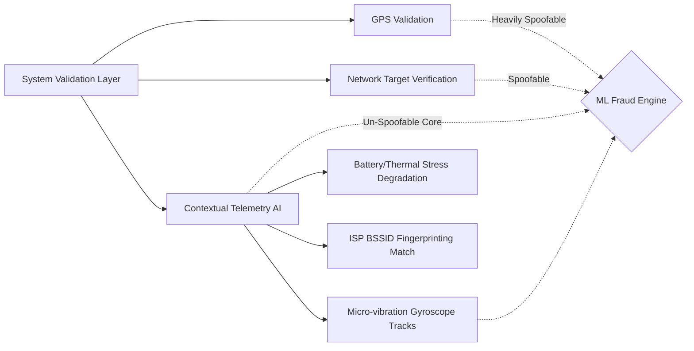

  
  <h1>🛡️ GigShield AI</h1>
  
<strong>AI-Powered Parametric Insurance for India’s Gig Economy</strong>

  
<em>Phase 1: Ideation & Foundation Submission</em>

  
   

  <!-- Main Dashboard Overview Image -->
  

---

## 📖 1. The Core Problem & Our Strategy

India's platform-based delivery partners (Zomato, Swiggy, Zepto) form the backbone of our fast-commerce economy. However, they operate completely exposed to environments they cannot control. A sudden 90mm torrential downpour, a severe AQI smog, or an unplanned local curfew instantly destroys their ability to fulfill orders, frequently resulting in a devastating **20–30% loss of expected daily income**. 

Traditional insurance protects their health or their vehicles, but **nothing protects their time or their lost wages**. 

**GigShield AI** is a revolutionary parametric micro-insurance platform designed exclusively to monitor these uncontrollable external disruptions via data oracles, calculate the financial gap, and **instantly reimburse lost wages**.

---

## 🎯 2. Persona Focus: Who is the User, Really?

We are not building a generic net for "everyone". We are building specifically for **Food & Q-Commerce Delivery Partners (Zomato/Swiggy/Zepto)**.

**Meet Rahul.** 
Rahul is a 24-year-old Zomato delivery partner in Mumbai. He works 10-hour shifts, 6 days a week, relying totally on dynamic daily payouts to cover fuel, bike maintenance, and his family's rent. He does not have savings, a corporate safety net, or paid time off. 

On a Friday evening, a sudden torrential downpour completely floods his delivery zone. Restaurants shut down, and the Zomato app pauses routing. Rahul is perfectly healthy and his bike isn't broken—but he is unable to work, instantly losing an expected ₹500 in earnings. He is a victim purely of external disruption. GigShield AI is built precisely to catch him.

**The Workflow Scenario:** 
GigShield continuously monitors local weather API triggers in Rahul's geofence. Within seconds of the heavy rain disruption threshold being met, the AI Engine calculates the expected ₹500 vs the actual ₹200 he managed to earn before the storm, and **automatically pays out the ₹300 difference** to his wallet—no claims adjusters, no delays, zero friction.

---

## 📅 3. Weekly Premium Pricing Model & Parametric Triggers

Because gig workers like Rahul generate and manage cash purely on a week-to-week cycle, our financial model **strictly avoids annual premiums.** We designed micro-weekly deductions synced exactly to their operational cash flow.

| Plan Tier | Cost (Weekly) | Max Financial Coverage | Max Claims / Week | Target Worker Profile |
|-----------|---------------|------------------------|-------------------|-----------------------|
| **Basic** | ₹10/wk        | ₹300                   | 1                 | Part-time Rider       |
| **Pro**   | ₹25/wk        | ₹800                   | 2                 | Regular Weekly Rider  |
| **Elite** | ₹40/wk        | ₹1500                  | 3                 | Full-time Dedicated   |

### ⚡ Defined Parametric Triggers (Income Loss Only)
1. **Environmental Disruptions:** Heavy Rain / Flooding / High AQI (Hazardous air where riding is medically dangerous).
2. **Social/Systemic Disruptions:** Unplanned localized curfews or sudden App/Server Crashes (e.g., the delivery platform's server crashes, erasing peak earning potential).

### 📱 Web vs. Mobile Platform Justification
We built GigShield exclusively as a **Mobile-First Progressive Web Application (PWA)**. 
*Why?* Gig workers shouldn't be forced to own expensive phones with vast storage just to download another heavy 200MB native app to manage micro-insurance. A lightweight, browser-based web dashboard ensures zero friction, taking up zero local storage space, while offering maximum accessibility across 3G/4G networks on lower-end Android devices.

---

## 🚨 4. THE MARKET CRASH RESPONSE: Deep-Validation Anti-Spoofing Protocol

**The Zero-Day Threat (The Market Crash):** 
A sophisticated syndicate of 500 delivery workers in a tier-1 city exploits the system using advanced GPS-spoofing applications. While resting safely at home, they trick the system into believing they are trapped in a red-alert weather zone, triggering mass false payouts and instantly draining the liquidity pool.

**Our AI Solution: Multi-Layered Contextual Telemetry.** 
Standard systems fail because they parse single-point flat `lat/long` coordinates. GigShield AI utilizes deeper context. How does it actually work?

If a spoofer fakes their GPS from their couch, their device's biomechanical telemetry (gyroscope) remains perfectly static compared to a working driver navigating a flooded street. Furthermore, if 50 "stranded" workers map out to the exact same residential Wi-Fi BSSID footprint, they are instantaneously flagged as a syndicate node. 
Our backend isolates the static footprint, realizes it's an organized spoofer despite the "valid" GPS coordinates, and drops a **Syndicate Block** on the claim—saving the market pool.

*(See the `Interactive Environment Modifiers` toggle on our UI Dashboard preview below, which allows admins to test this live during the demo!)*

  

---

## 🧠 5. How Does the AI Actually Work? The ML Foundation

Our artificial intelligence engine governs the two most critical nodes of the insurance lifecycle to ensure long-term platform liquidity and strict profitability:

### A. Dynamic Risk Assessment & Premium Calculation (XGBoost Regression)
How does our pricing actually get calculated? Our backend model pulls massive historical meteorological datasets (IMD), historical traffic gridlock heatmaps, and platform delivery volume data. The AI processes these variables to forecast the *probability of an income-stopping event* in a specific geo-fence for the upcoming week. It outputs a dynamic `0.0` to `1.0` **Location Risk Score** (e.g., Mumbai in Monsoon season), mechanically adjusting the suggested localized micro-premium. This dynamically protects the structural payout pool from heavy geographic biases.

### B. Intelligent Fraud Detection (Isolation Forests & Clustering)
Our adversarial defense against GPS-spoofers relies on Isolation Forest algorithms for anomaly detection. By clustering legitimate "stranded worker" data points (thermal stress, cellular network hopping, minor gyro bumps from idling bikes), our model trains to isolate extreme anomalies—such as a worker reporting to be in heavily flooded area while maintaining a perfectly cool internal battery temperature and a static 0,0,0 XYZ gyroscope reading.

---

## 🧰 6. Tech Stack & 6-Week Execution Plan

### How Does it Get Built? The Tech Stack
- **Frontend UI:** React.js, Vite, Tailwind CSS (Glassmorphism), Lucide Icons for rapid, high-fidelity native-feeling UX.
- **Backend Architecture:** Node.js, Express.js microservices.
- **Database:** MongoDB Atlas (Cloud) storing immutable Claim Logs, User Policies, and Telemetry Records.
- **AI/ML Layer (Future):** Python (Scikit-learn, TensorFlow) API orchestrations.

### The 6-Week Phase Roadmap
- **📍 Phase 1 (Weeks 1-2): [Current]** Ideation, Persona Focus, Architectural Foundation, and UI Prototypes. We completed the core MERN stack setup and built our backend logic engines, particularly the core Parametric Payout formula and the Anti-Spoofing logic defending against the Market Crash scenario.
- **📍 Phase 2 (Weeks 3-4):** Hard Integration of external live Oracle APIs (OpenWeather / Google Maps Traffic integrations) replacing our current demo simulation bounds. We will begin feeding production data into our predictive datasets.
- **📍 Phase 3 (Weeks 5-6):** Hardening smart contracts, security penetration testing across simulated localized spoofing loads, implementing actual Web3 or traditional micro-payment gateway mockups, and reaching MVP production readiness.

---

### The Admin Intelligence Portal
Our platform gives actuaries and insurers a bird's-eye global view of all aggregated risk metrics, payout volume trends over a rolling 7-day period, and a live operational feed of processed claims.

  

