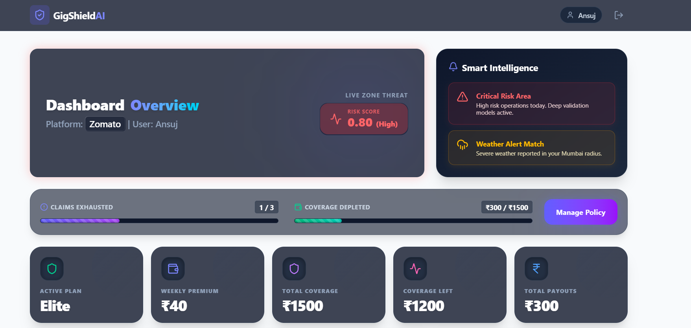
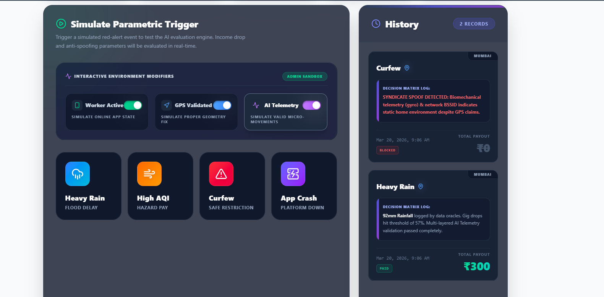
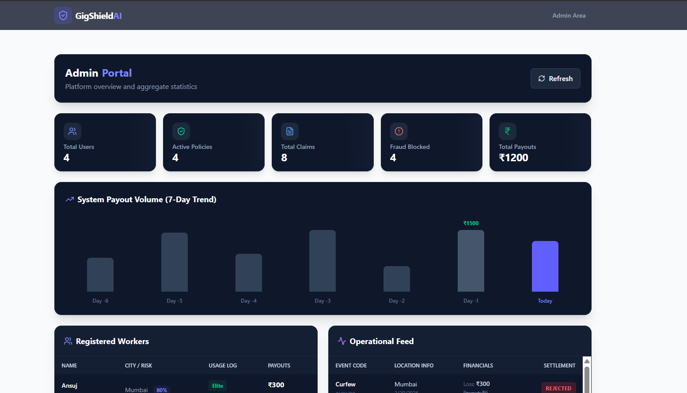
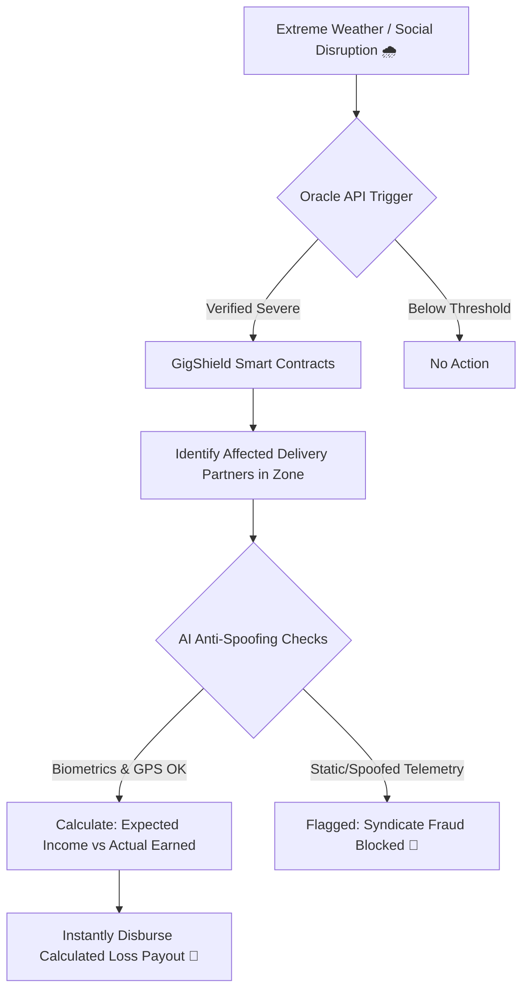
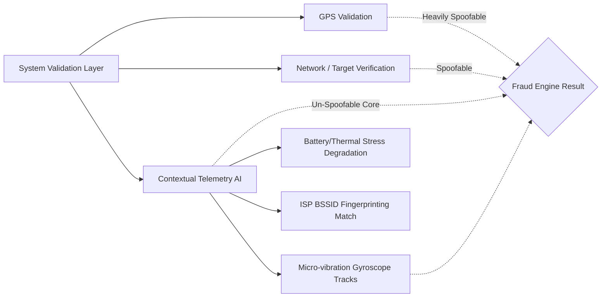

  
  <h1>🛡️ GigShield AI</h1>
  
<strong>AI-Powered Parametric Insurance for India’s Gig Economy</strong>

  
<em>Phase 1: Ideation & Foundation Submission</em>

  
   

  <!-- Main Dashboard Overview Image -->
  

---

## 📖 1. The Idea & Core Problem Strategy

India's platform-based delivery partners (Zomato, Swiggy, Zepto) are the absolute backbone of our fast-paced fast-commerce economy. However, they operate completely exposed to environments they cannot control. A sudden 90mm torrential downpour, a severe AQI smog, or an unplanned local curfew instantly destroys their ability to fulfill orders, frequently resulting in a devastating **20–30% loss of expected daily income**. 

Currently, they are forced to bear this financial impact entirely on their own. Traditional insurance protects their health or their vehicles, but **nothing protects their time or their lost wages**. 

**GigShield AI** is a revolutionary parametric micro-insurance platform designed exclusively to monitor these uncontrollable external disruptions via data oracles, calculate the financial gap, and **instantly reimburse lost wages**.

### 🎯 Persona Focus & Workflow Scenarios
- **Our Dedicated Persona:** Food & Q-Commerce Delivery Partners (e.g., Zomato, Swiggy, Zepto/Blinkit) who rely on high-volume, time-sensitive trips.
- **The Core Scenario:** A Zomato partner in Mumbai is scheduled during a surge and expects to make ₹500 on a Friday evening. A sudden torrential downpour completely halts the city grid, causing massive restaurant delays. The partner is stranded and only makes ₹200.
**GigShield** continuously monitors local weather API triggers. Within seconds of the disruption threshold being met, it instantly calculates the expected ₹500 vs the actual ₹200 earned, and **automatically pays out the ₹300 difference** to their wallet—no claims adjusters, no delays, and absolute zero friction.

---

## 📸 2. Platform Previews & Prototypes

We have fully built the architectural prototype for our smart-claim logic.

### A. The Dashboard & Interactive Fraud Sandbox
The primary interface for delivery partners to manage their coverage. During the Phase 1 demo, we have included an **Interactive Environment Modifiers** sandbox to allow judges to seamlessly toggle live telemetry modifiers and test our neural fraud engines in real-time.

  

### B. The Admin Intelligence Portal
Our platform gives actuaries and insurers a bird's-eye global view of all aggregated risk metrics, total payout volume trends over a rolling 7-day period, and a live operational feed of all processed and rejected claims.

  

---

## ⚙️ 3. The GigShield Workflow Architecture

Below is the automated, zero-friction parametric insurance workflow built directly into the GigShield smart-contract system.

---

## 📅 4. Weekly Premium Pricing Model & Triggers

Gig workers operate and are paid strictly week-to-week via their platform aggregators. Thus, our financial model avoids aggressive annual commitments in favor of **micro-weekly premium deductions** synced exactly to their existing cash flow.

| Plan Tier | Cost (Weekly) | Max Financial Coverage | Max Claims / Week | Target Worker Profile |
|-----------|---------------|------------------------|-------------------|-----------------------|
| **Basic** | ₹10/wk        | ₹300                   | 1                 | Part-time Rider       |
| **Pro**   | ₹25/wk        | ₹800                   | 2                 | Regular Weekly Rider  |
| **Elite** | ₹40/wk        | ₹1500                  | 3                 | Full-time Dedicated   |

### ⚡ Defined Parametric Triggers (Income Loss Only)
1. **Environmental Disruptions:** Heavy Rain / Flooding / High AQI (Hazardous air where riding is medically dangerous).
2. **Social/Systemic Disruptions:** Unplanned localized curfews or sudden App/Server Crashes (e.g., the delivery platform's AWS servers fail for 3 hours on a weekend, erasing peak earning potential).

### 📱 Web vs. Mobile Platform Justification
We built GigShield exclusively as a **Mobile-First Progressive Web Application (PWA)**. 
*Why?* Gig workers shouldn't be forced to own expensive phones with vast storage just to download another heavy 200MB native app to manage micro-insurance. A lightweight, browser-based web dashboard ensures zero friction, taking up zero local storage space, while offering maximum accessibility across 3G/4G networks and lower-end Android devices.

---

## 🧠 5. AI/ML Integration Strategy

Our artificial intelligence engine governs the two most critical nodes of the insurance lifecycle to ensure long-term platform liquidity and strict profitability:

### A. Dynamic Risk Assessment & Premium Calculation
Our regression models assess vast historical geographical data (e.g., frequency of monsoons in Mumbai versus continuous traffic gridlock in Bangalore) and assign a dynamic `0.0` to `1.0` **Location Risk Score** to the worker's operational zone. This mathematically adjusts their localized premium suggestions to protect the structural payout pool from heavy geographic biases.

### B. Intelligent Fraud Detection (Adversarial Defense)
**The Crisis:** A syndicate of 500 delivery workers spoofing their GPS from home to drain the pool via a mass weather payout.
**The AI Solution:** Standard systems only read flat `lat/long` coordinates. Our AI model utilizes **Multi-Layered Contextual Telemetry**. 

If a spoofer fakes their GPS from their living room couch, their device's biomechanical telemetry (gyroscope) is perfectly static compared to a working driver navigating a storm. Our backend flags the static footprint, realizes it's an organized spoofer despite the "valid" GPS coordinates, and instantly drops a **Syndicate Block** on the claim. 

---

## 🧰 6. Tech Stack & 6-Week Dev Plan

### Technology Stack
- **Frontend UI:** React.js, Vite, Tailwind CSS (Glassmorphism), Lucide Icons.
- **Backend Architecture:** Node.js, Express.js.
- **Database:** MongoDB Atlas (Cloud) storing immutable Claim Logs, User Policies, and Risk Matrices.

### The 6-Week Roadmap
- **📍 Phase 1 (Weeks 1-2): [Current]** Ideation, Persona Research, Architecture Foundation, and UI Prototypes. Completed the anti-spoofing backend Logic Engine.
- **📍 Phase 2 (Weeks 3-4):** Hard Integration of external live Oracle APIs (OpenWeather / Google Maps Traffic integrations) and training the risk-assessment predictive datasets.
- **📍 Phase 3 (Weeks 5-6):** Hardening smart contracts, security penetration testing across simulated server loads, implementing the payment gateway mockups, and final hackathon presentation polish.
