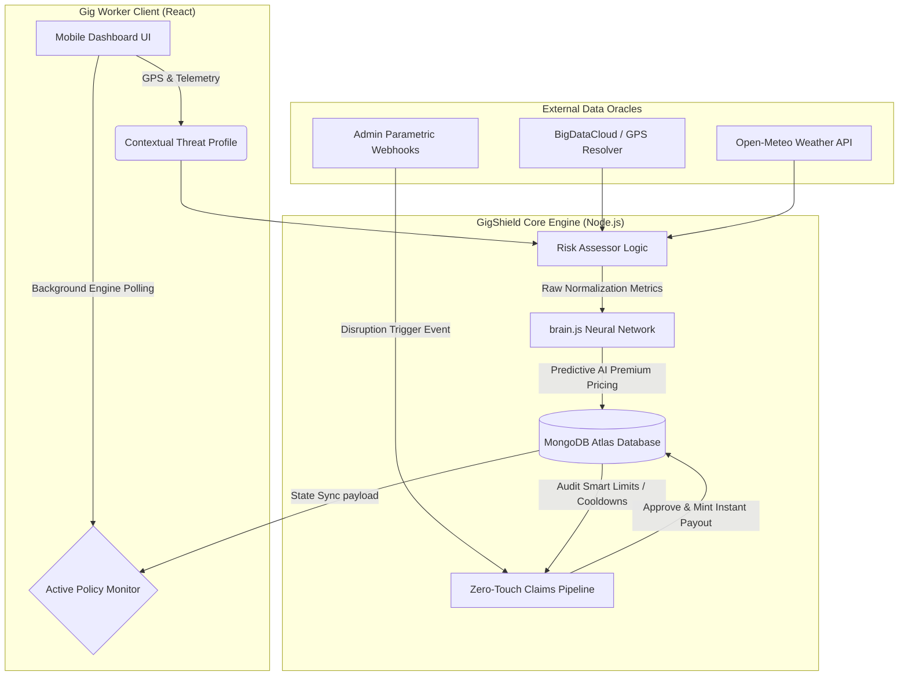
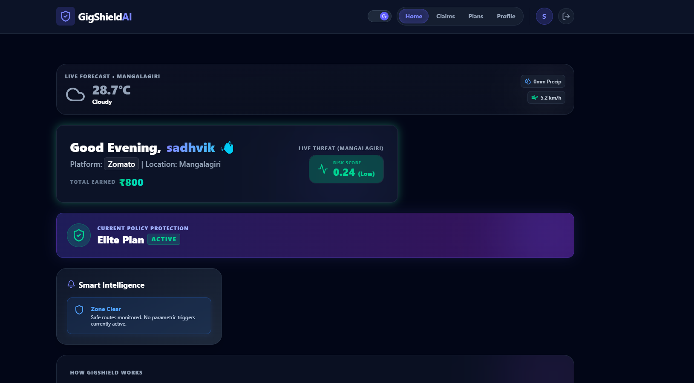
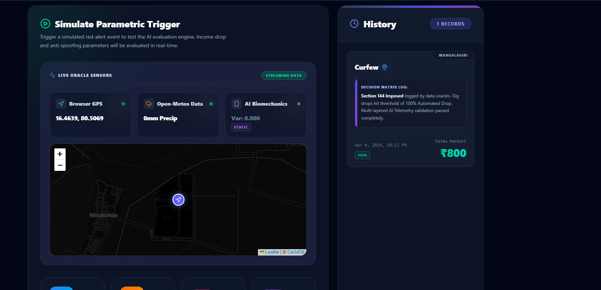
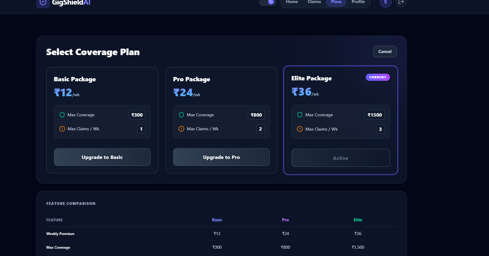
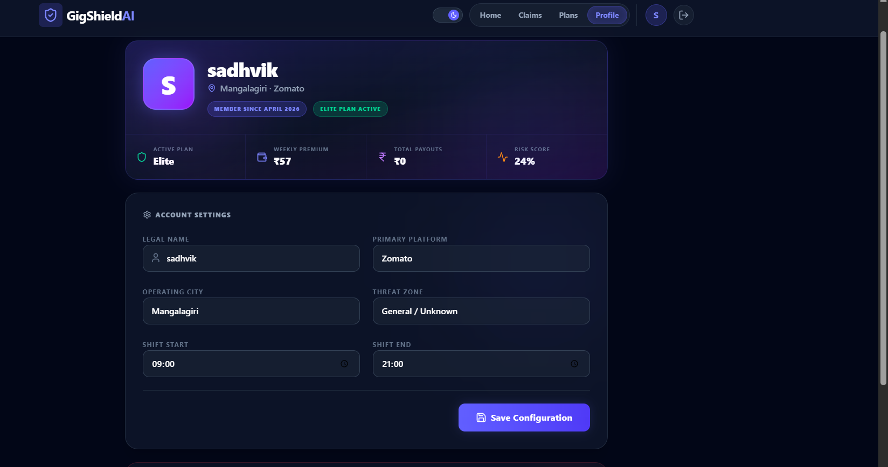
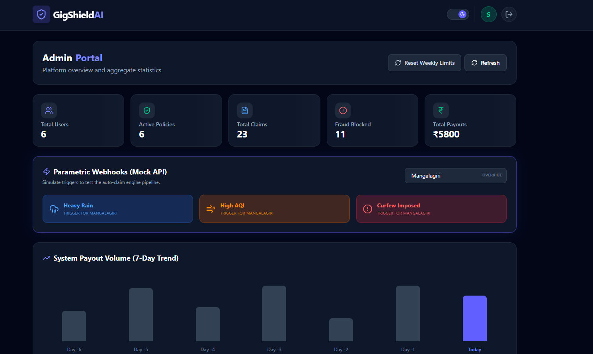

  
  
  
  

 

# 🛡️ GigShield AI 
### *Theme: "Protect Your Worker"*

**GigShield AI** is a next-generation parametric micro-insurance platform designed explicitly for gig workers (delivery partners, ride-hailing drivers, logistics personnel). In a world where gig workers face constant environmental and systemic threats (heavy monsoons, oppressive heatwaves, platform outages, curfews) without any safety net, GigShield offers an **Automated, Zero-Touch Liquidity Solution.**

Instead of forcing workers to engage in archaic, paperwork-heavy claims processes that take weeks to resolve, GigShield leverages **Live Weather Oracles**, **Parametric Thresholds**, and an embedded **Neural Network** to instantly and autonomously deposit funds into a worker's account the exact second a disaster is mathematically verified.

---

## 🔥 Hackathon Deliverables & Core Capabilities

This project strictly adheres to the Phase 2 Hackathon Rubric:

### 1. 📝 Hyper-Localized Registration Process
Workers onboard by providing more than just their name. GigShield captures:
- **Operating City:** Providing base geospatial anchoring.
- **Primary Platform:** Zomato, Swiggy, Uber, etc.
- **Micro-Threat Zones:** Workers specify extreme hyper-local contexts (e.g., *Flood Prone Dharavi* vs. *High-Ground Safe Areas*). 
**Contextual Risk Profiling:** By matching their base location telemetry with these specific threat zones, the platform computes a baseline risk percentage on day one.

### 2. 🛡️ Modular Insurance Policy Management
The traditional concept of a "yearly premium" fundamentally isolates gig workers, who operate on weekly cash flow constraints. We rebuilt insurance policies horizontally:
- **Scalable Tiers:** Workers can freely slide between Basic (₹300 coverage), Pro (₹800 coverage), and Elite (₹1,500 coverage) weekly packages.
- **Mathematical Bound Constrains:** To permanently eradicate system manipulation, policies enforce a rigorous **24-hour Fraud Lock** period directly after purchase, alongside mathematically restricted weekly claim limits (e.g., maximum 1 claim per week on Basic, 3 claims on Elite).
- **Graceful Cancellation:** Workers possess total autonomy to cancel their premium obligations at the push of a button.

### 3. 🧠 Dynamic Premium Calculation (Machine Learning Integration)
GigShield abandons static, flat-rate pricing matrices. We integrated `brain.js`, a resilient neural network, deep into the backend architecture to dynamically generate hyper-personal premium costs.
- **Data Engineering:** The Neural Network fuses historical claim densities, the worker's categorical hazard zone, and **Live Weather APIs (Open-Meteo)**.
- **The Execution:** If the API projects a massive thunderstorm tracking directly over a flood-prone zone, the model instantly raises the premium overhead to offset risk. Conversely, if a worker operates during safe, dry conditions in an established low-crime grid, the AI algorithm dynamically slashes their weekly premium to hyper-affordable benchmarks (e.g., reducing a standard ₹50/wk premium down to ₹12/wk proactively).

### 4. ⚡ Seamless Zero-Touch Claim Process
The crown jewel of the platform is the absolute eradication of paperwork. When disaster hits, the gig worker does absolutely nothing.
- **The Parametric Oracles:** On the Admin Control Center, mock webhooks are attached to external environmental conditions (*Severe Weather Alert*, *Curfew Activation*, *Hazardous AQI*).
- **The Algorithmic Response:** When an oracle triggers, the backend aggressively scans a 3-kilometer geographic radius of the event, isolates all mathematically exposed workers, executes a strict fraud algorithm traversing their biometric history, and calculates their exact operational margin loss dynamically against the event's severity.
- **The UI Magic:** As the worker stares at their dashboard—distressed by an ongoing storm—our React-based 4-second asynchronous polling engine catches the blockchain-like backend transaction. The screen organically updates, sliding in a majestic green notification: **"✅ Zero-Touch Check Passed"**. Funds instantly materialize on their screen.

---

## 🏗️ System Architecture & Algorithmic Flow

---

## 📸 Interactive Platform Visuals

### 1. Home Dashboard
The centralized intelligence hub. Beautifully visualizes the worker's current operational risk factor in real time, factoring in dynamic weather variables and micro-biometric variance.

### 2. Zero-Touch Claims Pipeline
The core mechanic of GigShield. When an Admin Oracle triggers an anomaly, the worker automatically sees a beautiful, multi-stage loading timeline validating their biometric credentials, eventually ending in an automated instant liquidity deposit to their smart-wallet.

### 3. Dynamic Policy Management
Workers dynamically configure their protection tiers. Observe the deeply affordable AI-generated base prices specifically attuned to their live hazard algorithms.

### 4. Profile & Threat Configurator
Location is destiny in parametric insurance. The user explicitly selects their geospatial boundaries so the AI models can cross-reference against city topographical vulnerability.

### 5. Admin Control Center
The overarching monitoring nexus. Here, platform managers trace global micro-insurance throughput, handle volumetric fraud blockage, and execute sweeping city-wide parametric Mock APIs (Webhooks) simulating massive disruptions.

---

## 💻 Tech Stack & Security Specifications
- **Client Architecture:** `React.js` powered by `Vite`.
- **CSS Framework:** `TailwindCSS` with deeply integrated `Framer Motion` components bringing micro-glassmorphism interactions to life.
- **Backend Architecture:** Highly concurrent `Express.js` runtime constructed over `Node.js`.
- **Database Modality:** Cloud-synchronized `MongoDB Atlas` scaled via explicitly defined `Mongoose` schema boundaries.
- **Security Primitives:** Complete integration of banking-standard `bcryptjs` iterative hashing sequences enforcing immutable identity controls mapped through stateless `JSON Web Tokens (JWT)`.

---

## ⚙️ Running Locally

1. **Clone the Repository:** Execute `git clone` natively into your target workspace.
2. **Backend Configuration:**
    - Navigate into `/backend`.
    - Install necessary dependencies: `npm install`.
    - Create a `.env` file assigning `MONGODB_URI` to a compliant cluster string.
    - Mount the HTTP server: `npm start`.
3. **Frontend Configuration:**
    - Open a newly parallel shell inside `/frontend`.
    - Install strictly referenced React layers: `npm install`.
    - Deploy the Vite development server mapping local ports: `npm run dev`.
