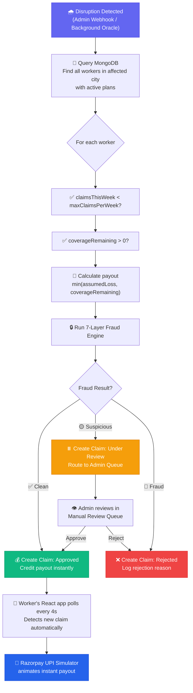
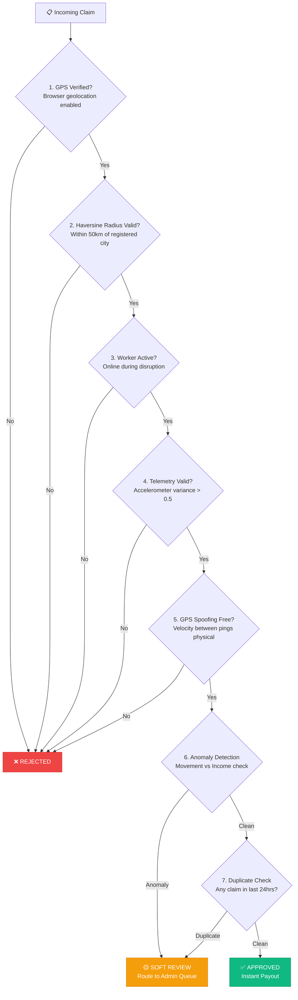
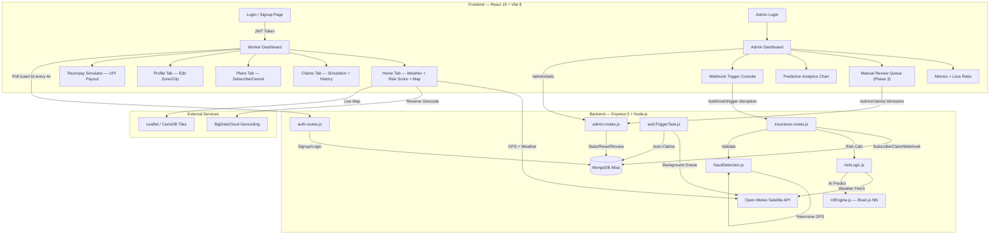
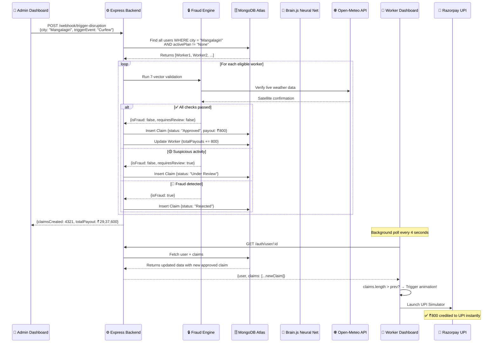

<div align="center">

  
  
  
  
  
  
  
  
  
  
  <br/><br/>
  
  <h1>🛡️ GigShield AI</h1>
  <h3><em>AI-Powered Parametric Micro-Insurance for India's 300 Million Gig Workers</em></h3>
  <h4>Guidewire DEVTrails 2026 — Phase 3: Scale & Optimise (Final Submission)</h4>
  
  <br/>

  <a href="https://gigshield-ai.vercel.app">🌐 Live Demo</a> · <a href="#-5-minute-video-demo">🎬 Demo Script</a> · <a href="#-system-architecture">🏗️ Architecture</a> · <a href="#-fraud-detection-engine-7-vector-validation">🔒 Fraud Engine</a>

</div>

---

## 📖 Table of Contents

1.  [The Problem We Solve](#-the-problem-we-solve)
2.  [Our Solution](#-our-solution--how-gigshield-works)
3.  [Phase 3 Innovations](#-phase-3-innovations-scale--optimise)
4.  [Core Deliverables](#-core-deliverables)
    - [Registration & Threat Profiling](#1--registration--threat-profiling)
    - [Insurance Policy Management](#2-%EF%B8%8F-insurance-policy-management)
    - [Neural Network Pricing](#3--dynamic-premium-calculation-via-neural-network)
    - [Zero-Touch Claims Pipeline](#4--zero-touch-claims-pipeline)
5.  [Automated Disruption Triggers](#-automated-disruption-triggers)
6.  [Fraud Detection Engine](#-fraud-detection-engine-7-vector-validation)
7.  [Instant Payout System](#-instant-payout-system-razorpay-upi-simulator)
8.  [Admin Command Center](#-admin-command-center)
9.  [System Architecture](#-system-architecture)
10. [Data Flow](#-data-flow--how-a-claim-is-born)
11. [Platform Screenshots](#-platform-screenshots)
12. [Tech Stack](#-complete-tech-stack)
13. [Project Structure](#-project-structure)
14. [Running Locally](#%EF%B8%8F-running-locally)
15. [Deployment](#-live-deployment)
16. [5-Minute Video Demo](#-5-minute-video-demo)
17. [Team](#-team)

---

## 🔥 The Problem We Solve

India has **15 million+ active gig workers** — Zomato riders, Swiggy delivery partners, Uber drivers, Zepto runners, Dunzo agents. They are the backbone of our ₹25 lakh crore digital economy, yet they face a devastating reality:

| Pain Point | Impact |
|-----------|--------|
| 🌧️ **No safety net** | When monsoons flood delivery zones, AQI hits hazardous levels, or curfews are imposed, their income drops to **₹0 instantly** |
| 💰 **Insurance is unaffordable** | Traditional products demand ₹15,000/year premiums. A worker earning ₹500/day cannot afford this |
| ⏳ **Claims take 30-45 days** | Manual adjusters, paper forms, evidence uploads — fundamentally broken for someone who needs money *today* |
| 🚫 **Adversarial process** | Even valid claims get rejected on technicalities. Workers lose trust and stop participating |
| 📉 **20-30% income loss** | External disruptions cause massive, uninsured earnings drops every monsoon season |

> **GigShield AI eliminates every one of these barriers.**

---

## 💡 Our Solution — How GigShield Works

GigShield reimagines insurance from first principles for the gig economy, built on three revolutionary pillars:

### 1. Parametric, Not Indemnity
We don't ask _"prove your loss."_ We measure objective external parameters (rainfall in mm, AQI levels, government curfew orders) through satellite APIs, and if a threshold is breached, **the payout triggers algorithmically**. There is no claim filing step.

### 2. AI-Powered Hyper-Personalization
Every worker's premium is calculated by a **trained Feed-Forward Neural Network** (`brain.js`) that evaluates their specific operating zone, real-time weather telemetry from the Open-Meteo satellite API, and historical claims frequency. A worker in a historically safe area pays dramatically less than someone in a flood-prone zone during monsoon season.

### 3. Zero-Touch UX
When a disruption is detected, the backend **autonomously** identifies affected workers, validates eligibility through a 7-layer fraud engine, computes the payout, and credits it to their UPI account via Razorpay — all within seconds. The worker sees the money appear without lifting a finger.

---

## 🆕 Phase 3 Innovations (Scale & Optimise)

Phase 3 transforms GigShield from a prototype into a **production-grade, demo-ready platform** with enterprise features:

```mermaid
graph LR
    subgraph "Phase 1: Build"
        A[Registration] --> B[Basic Plans]
        B --> C[Manual Claims]
    end
    
    subgraph "Phase 2: Protect"
        D[Neural Network Pricing] --> E[7-Layer Fraud Engine]
        E --> F[Zero-Touch Pipeline]
        F --> G[Background Weather Oracle]
    end
    
    subgraph "Phase 3: Scale & Optimise"
        H["🆕 Soft-Review Fraud Queue"] --> I["🆕 Admin Manual Review"]
        I --> J["🆕 Razorpay UPI Simulator"]
        J --> K["🆕 Animated Success Overlays"]
        K --> L["🆕 Predictive Analytics Dashboard"]
        L --> M["🆕 Mass Payout Orchestration"]
    end
    
    C --> D
    G --> H

    style H fill:#10b981,stroke:#059669,color:#fff
    style I fill:#10b981,stroke:#059669,color:#fff
    style J fill:#10b981,stroke:#059669,color:#fff
    style K fill:#10b981,stroke:#059669,color:#fff
    style L fill:#10b981,stroke:#059669,color:#fff
    style M fill:#10b981,stroke:#059669,color:#fff
```



| Feature | Description |
|---------|-------------|
| 🟡 **Soft-Review Fraud Queue** | Borderline claims (e.g., 24-hour cooldown breaches) are soft-flagged as `Under Review` instead of hard-rejected, preserving trust with genuine workers |
| 👁️ **Admin Manual Review Panel** | A real-time, priority-sorted orange queue lets human underwriters approve or reject flagged claims with one click |
| 💸 **Razorpay UPI Simulator** | A premium, animated mock payment flow that demonstrates instant UPI credit to the worker's digital wallet upon claim approval |
| ✨ **Glassmorphism Success Overlay** | When mass payouts are triggered via webhook, a stunning animated overlay slides up showing claims settled and total payout volume |
| 📊 **Predictive Analytics Engine** | A brain.js-powered 7-day forecast chart that anticipates claim spikes based on weather predictions, letting insurers prepare capital liquidity |
| 🏭 **Mass Payout Orchestration** | A single webhook call can process thousands of claims simultaneously across an entire city, demonstrating enterprise-scale capability |

---

## 🚀 Core Deliverables

### 1. 📝 Registration & Threat Profiling

Workers register with contextual information that powers the AI engine:

| Field | Purpose | Example |
|-------|---------|---------|
| **Name** | Identity | Ravi |
| **City** | Geographic anchor for event matching | Mangalagiri |
| **Platform** | Primary gig employer | Zomato, Swiggy, Uber, Zepto |
| **Threat Zone** | Hyper-local risk classification | "Flood Prone" vs "Low Risk" |
| **Working Hours** | Shift window for active-period validation | 09:00 – 21:00 |
| **GPS Coordinates** | Auto-captured via browser Geolocation API | 16.4639, 80.5069 |

**Under the hood during registration:**
1. `riskLogic.js` calls the **Open-Meteo API** with the worker's GPS to fetch live precipitation and weather code data
2. These values are fed into the **Brain.js Neural Network** (`mlEngine.js`) alongside the zone danger level
3. The NN outputs a `premiumScale` (0.1–0.95), denormalized into a base premium in Rupees (₹5–₹50)
4. The computed risk score and premium are persisted in MongoDB and returned to the frontend

**Security:** Passwords are hashed using `bcryptjs` (salt factor 10). Authentication uses stateless `JWT` tokens with 7-day expiry.

---

### 2. 🛡️ Insurance Policy Management

GigShield offers **weekly micro-policies** that workers can activate, upgrade, or cancel at any time:

| Plan | Weekly Premium | Max Coverage | Claims/Week | Target Worker |
|------|:-------------:|:-----------:|:-----------:|--------------|
| 🟢 **Basic** | ₹12/wk* | ₹300 | 1 | Part-time riders |
| 🔵 **Pro** | ₹24/wk* | ₹800 | 2 | Full-time delivery partners |
| 🟣 **Elite** | ₹36/wk* | ₹1,500 | 3 | High-risk zone workers |

> *\*Premiums shown are AI-calculated base rates. Actual premium varies dynamically based on the worker's zone, live weather, and claims history.*

**Built-in safeguards:**
- 🔒 **24-Hour Maturity Lock:** Newly subscribed policies must mature before claims can be processed, preventing workers from subscribing *after* seeing a storm forecast
- 📊 **Weekly Caps:** Each plan enforces strict `maxClaimsPerWeek` and `coverageRemaining` ceilings
- 🚪 **Graceful Cancellation:** Workers can cancel any time via the `/insurance/cancel` endpoint

---

### 3. 🧠 Dynamic Premium Calculation via Neural Network

This is the core AI innovation. We use `brain.js` (v1.6.1) to replace static pricing tables with a trained ML model.

**Neural Network Architecture (`mlEngine.js`):**

```
Input Layer (3 neurons)          Hidden Layers              Output Layer (1 neuron)
┌──────────────────┐         ┌──────────────┐           ┌──────────────────┐
│  zoneDanger      │────────▶│  4 neurons   │──────────▶│                  │
│  (0.1 - 0.9)     │         │  (sigmoid)   │           │  premiumScale    │
├──────────────────┤         ├──────────────┤           │  (0.1 - 0.95)    │
│  weatherSeverity │────────▶│  4 neurons   │──────────▶│                  │
│  (0.1 - 0.9)     │         │  (sigmoid)   │           └──────────────────┘
├──────────────────┤         └──────────────┘
│  pastClaimsFreq  │────────▶
│  (0.1 - 0.9)     │
└──────────────────┘
```

**Input Normalization:**

| Input | Source | Normalization |
|-------|--------|---------------|
| `zoneDanger` | Worker's registered threat zone | "Low Risk" → 0.1, "General" → 0.5, "Flood Prone" → 0.9 |
| `weatherSeverity` | Live rainfall from Open-Meteo (mm) | `min(0.9, (rain_mm / 20) + 0.1)` |
| `pastClaimsFreq` | Historical claim count from MongoDB | `min(0.9, (claims / 5) + 0.1)` |

**Training:** 10 synthetic scenarios, 20,000 iterations, learning rate 0.1, error threshold 0.005.

**Real-world pricing examples:**

| Worker | Zone | Weather | Claims | AI Premium | Elite Cost |
|--------|------|---------|--------|:----------:|:----------:|
| Ravi (Mangalagiri) | Low Risk | 0mm rain | 0 | ~₹5/wk | ₹15/wk |
| Priya (Dharavi, Mumbai) | Flood Prone | 12mm rain | 2 | ~₹33/wk | ₹99/wk |

> The model charges ₹18 less per week for the safe-zone worker — exactly the kind of hyper-local, fair dynamic pricing the hackathon brief requires.

---

### 4. ⚡ Zero-Touch Claims Pipeline

The crown jewel of GigShield. When a disruption occurs, the worker does **absolutely nothing**. The system handles everything:



---

## 🌐 Automated Disruption Triggers

GigShield implements **5 distinct parametric triggers** using public and simulated APIs:

| # | Trigger | Source | Threshold | Impact |
|:-:|---------|--------|-----------|--------|
| 1 | 🌧️ **Heavy Rainfall** | Open-Meteo API (live satellite) | >10mm precipitation | Delivery routes flooded, orders cancelled |
| 2 | 🏭 **Hazardous AQI** | Simulated API (Admin) | AQI > 450 | Health risk forces workers indoors |
| 3 | 🚨 **Government Curfew** | Simulated API (Admin) | Section 144 imposed | Movement banned, zero deliveries |
| 4 | 📱 **Platform Outage** | Simulated Event (Worker) | Server downtime >45min | App-based workers lose all orders |
| 5 | 🤖 **Background Weather Oracle** | `autoTriggerTask.js` | Auto-check every 10 min | Monitors Mumbai, Delhi, Bangalore via Open-Meteo; auto-triggers claims when severe rain detected |

> **Trigger 5** is a fully autonomous background task that boots with the server. It is true serverless parametric insurance — zero humans in the loop.

---

## 🔒 Fraud Detection Engine (7-Vector Validation)

GigShield doesn't blindly approve claims. The `fraudDetection.js` module runs **7 independent validation vectors** before any payout is authorized:



| # | Check | What It Does | Rejection Reason |
|:-:|-------|-------------|-----------------|
| 1 | **GPS Verification** | Confirms browser geolocation is enabled and coordinates exist | _"Browser location disabled or unavailable"_ |
| 2 | **Haversine Radius** | Calculates great-circle distance to verify worker is within 50km of registered city | _"GPS location outside authorized policy radius"_ |
| 3 | **Worker Activity** | Confirms worker was actively online during the disruption window | _"Worker flagged as offline/inactive"_ |
| 4 | **Biomechanical Telemetry** | Checks accelerometer variance > 0.5 to detect static/spoofed device farms | _"Biomechanical telemetry indicates static device"_ |
| 5 | **GPS Node Spoofing** | Validates velocity between historical GPS pings doesn't exceed physical limits | _"Velocity between pings exceeds vehicle limitations"_ |
| 6 | **Anomaly Detection** | Flags high movement variance with ₹0 income (simulated routing) | ⚠️ Routes to Soft Review |
| 7 | **24-Hour Duplicate Guard** | Queries MongoDB for recent claims from same user | ⚠️ Routes to Soft Review |

> **Phase 3 Innovation:** Checks 6 and 7 trigger our new **Soft-Review** state instead of hard rejection, preventing genuine confused workers from being permanently blocked.

---

## 💸 Instant Payout System (Razorpay UPI Simulator)

When the fraud engine approves a claim, the **Razorpay UPI Simulator** (`RazorpaySimulator.jsx`) launches immediately:

**Payout Flow:**

```
Triggered → Validated → Approved → Paid (UPI Credit)
```

**Features of the Simulator:**
- 🎨 Premium dark glassmorphism UI matching the Razorpay brand aesthetic
- 💳 Displays worker's UPI ID, bank account, and exact payout amount
- ⏳ Animated processing spinner with stage transitions
- ✅ Green "Payment Successful" confirmation with receipt details
- 📋 Timestamped transaction receipt with breakdown (amount, reason, reference ID)

> The simulator demonstrates how the production Razorpay/UPI integration would look without requiring actual payment gateway credentials during the hackathon.

---

## 👁️ Admin Command Center

The Admin Portal provides complete platform oversight with intelligent automation:

### Dashboard Metrics
| Metric | Purpose |
|--------|---------|
| 👥 Total Users | Platform adoption tracking |
| 🛡️ Active Policies | Revenue stream visibility |
| 📋 Total Claims | Volume monitoring |
| 🚫 Fraud Blocks | Security effectiveness |
| 💰 Total Payouts | Financial exposure tracking |
| 📈 Loss Ratio | `(totalPayouts / totalPremiums)` — business viability indicator |

### Predictive Analytics (brain.js Forecast)
A 7-day forward-looking chart combining the ML model with weather predictions to anticipate claim spikes. Alerts the operator when a high-risk weather event is approaching, enabling proactive capital liquidity preparation.

### Manual Review Queue (Phase 3)
A dynamic, priority-sorted orange panel that surfaces all `Under Review` claims. Each entry shows the worker's name, trigger event, AI-generated reason for flagging, and one-click Approve/Reject buttons.

### Parametric Webhook Console
Allows operators to simulate city-wide disruptions (Heavy Rain, High AQI, Curfew, App Crash) targeting a specific city. When triggered, the system processes claims for all eligible workers in that geography and displays results in a beautiful animated glass overlay.

---

## 🏗️ System Architecture



---

## 📊 Data Flow — How a Claim is Born



---

## 📸 Platform Screenshots

### 🏠 Worker Dashboard — Home Tab
The central intelligence hub for gig workers. Displays live weather from Open-Meteo API, dynamically computed risk score with animated color coding (Low/Medium/High), current policy status, total payout earnings, and a greeting contextual to time-of-day. Includes a Leaflet dark-themed map with live GPS tracking.


---

### ⚡ Claims Tab — Simulation & History
Workers can simulate parametric disruption events or view their complete claims history. Each claim card shows the trigger event, the algorithmic decision matrix log, timestamp, payout amount, and fraud check results. Live oracle sensors (Browser GPS, Open-Meteo precipitation data, AI Biomechanics variance) are displayed in real-time.


---

### 📋 Plans Tab — Dynamic Policy Selection
All three tiers displayed with AI-calculated prices personalized to the worker's risk profile. The feature comparison table lets workers make informed decisions. Premiums dynamically change based on the worker's zone, weather conditions, and claims history.


---

### 👤 Profile Tab — Risk Configuration
Workers can update their city, threat zone, and platform at any time. When changed, the backend recalculates the risk score by re-querying the Neural Network with updated parameters via the Open-Meteo API.


---

### 🖥️ Admin Command Center
The platform operator's command center. Shows aggregate system metrics (total users, active policies, total claims, fraud blocks, cumulative payouts, loss ratio). The "Parametric Webhooks" section lets admins trigger city-wide disruptions. Includes a 7-day payout volume chart and a brain.js predictive analytics forecast.


---

## 💻 Complete Tech Stack

### Frontend
| Technology | Version | Purpose |
|-----------|:-------:|---------|
| React | 19.2 | Core UI framework with hooks and context |
| Vite | 8.0 | Lightning-fast build tool and HMR dev server |
| TailwindCSS | 4.2 | Utility-first CSS framework for premium UI |
| Framer Motion | 11.18 | Page transitions, claim popups, micro-animations |
| anime.js | 3.2 | Risk score counter animations |
| Leaflet + react-leaflet | 1.9 / 5.0 | Interactive dark-themed map with GPS trail |
| Lucide React | 0.577 | Consistent, beautiful icon system |
| Axios | 1.13 | HTTP client for all API communication |
| Three.js + React Three Fiber | 0.183 | 3D animated particle login background |

### Backend
| Technology | Version | Purpose |
|-----------|:-------:|---------|
| Node.js | 22.x | Server runtime |
| Express | 5.2 | REST API framework |
| MongoDB + Mongoose | 9.3 | Document database with schema validation |
| brain.js | 1.6.1 | Neural network for dynamic premium prediction |
| bcryptjs | 3.0 | Password hashing (salt factor 10) |
| jsonwebtoken | 9.0 | Stateless JWT authentication tokens |
| Axios | 1.14 | Server-side HTTP for Open-Meteo API calls |

### External APIs & Services
| API | Provider | Usage |
|-----|----------|-------|
| 🌐 Weather Forecast | Open-Meteo (free, no API key) | Live precipitation, temperature, weather codes, wind speed |
| 📍 Reverse Geocoding | BigDataCloud (free) | Converting GPS lat/lon to human-readable city names |
| 🗺️ Map Tiles | CartoDB Dark Matter | Dark-themed map rendering for GPS trail visualization |
| 💸 UPI Payment | Razorpay Simulator (mock) | Instant payout demonstration via simulated UPI flow |

---

## 📁 Project Structure

```
gigshield/
├── backend/
│   ├── server.js                     # Express app entry, MongoDB connection, Oracle boot
│   ├── models/
│   │   ├── User.js                   # User schema (city, zone, plan, coverage, claims)
│   │   └── Claim.js                  # Claim schema (trigger, loss, payout, fraud checks, status)
│   ├── routes/
│   │   ├── auth.routes.js            # Signup (bcrypt), Login (JWT), User fetch, Profile update
│   │   ├── insurance.routes.js       # Subscribe, Cancel, Simulate event, Zero-Touch Webhook
│   │   └── admin.routes.js           # Stats, Weekly reset, Claims review (Phase 3)
│   └── utils/
│       ├── mlEngine.js               # Brain.js Neural Network (train + predict premium)
│       ├── riskLogic.js              # Open-Meteo fetch → ML prediction orchestrator
│       ├── fraudDetection.js         # 7-vector fraud engine (GPS, Haversine, telemetry, etc.)
│       └── autoTriggerTask.js        # Background oracle polling 3 cities every 10 minutes
├── frontend/
│   └── src/
│       ├── App.jsx                   # Router with ProtectedRoute and AdminRoute guards
│       ├── pages/
│       │   ├── Login.jsx             # Signup/Login with geolocation capture + 3D background
│       │   ├── Dashboard.jsx         # 4-tab dashboard (Home, Claims, Plans) + 4s polling
│       │   ├── Profile.jsx           # Risk profile editor with live Neural Network recalc
│       │   ├── Admin.jsx             # Admin stats + review queue + webhook + predictive chart
│       │   └── AdminLogin.jsx        # Separate admin authentication flow
│       ├── components/
│       │   ├── RazorpaySimulator.jsx # Phase 3: Animated UPI payout experience
│       │   ├── WeatherWidget.jsx     # Live weather card (Open-Meteo integration)
│       │   ├── MapTracker.jsx        # Leaflet dark map with GPS polyline tracking
│       │   ├── Background3D.jsx      # Three.js animated particle background
│       │   ├── Navbar.jsx            # Top navigation bar with role detection
│       │   ├── BottomNav.jsx         # Mobile bottom navigation (iOS-style)
│       │   ├── ThemeToggle.jsx       # Light/Dark theme switcher
│       │   └── Sidebar.jsx           # Desktop sidebar navigation
│       └── contexts/
│           └── ThemeContext.jsx       # React context for theme state management
├── screenshots/                      # Platform screenshots for documentation
├── 5_MIN_DEMO_SCRIPT.md              # 5-minute video presentation script
├── PITCH_DECK_OUTLINE.md             # Slide deck outline for presentation
└── README.md                         # This file
```

---

## ⚙️ Running Locally

### Prerequisites
- Node.js v18 or higher
- MongoDB Atlas cluster (free tier works) or local MongoDB instance

### Backend Setup
```bash
cd backend
npm install

# Create .env file
echo "MONGODB_URI=your_mongodb_connection_string" > .env

# Start the server
npm start
```

Expected output:
```
🤖 [ML Framework] Booting AI Risk Engine...
🧠 [ML Framework] Neural Network Training Complete!
MongoDB connected successfully! 🚀
Server running on port 5000
[System] Automatic Parametric Oracle activated.
```

### Frontend Setup
```bash
cd frontend
npm install

# Optional: Set backend URL (defaults to production)
# Create .env with: VITE_API_URL=http://localhost:5000

npm run dev
```

The app will be available at `http://localhost:5173`.

---

## 🌍 Live Deployment

| Service | Platform | URL |
|---------|:--------:|:---:|
| 🖥️ Frontend | Vercel | [gigshield-ai.vercel.app](https://gigshield-ai.vercel.app) |
| ⚙️ Backend | Render | gigshield-backend-c1z7.onrender.com |
| 🗄️ Database | MongoDB Atlas | Cloud-hosted cluster |

---

## 🎬 5-Minute Video Demo

Our demo video follows a carefully choreographed script demonstrating all platform capabilities:

| Timestamp | Scene | What's Shown |
|:---------:|-------|-------------|
| 0:00–1:15 | **Problem & AI Pricing** | Register worker, Neural Network computes hyper-localized premium |
| 1:15–2:30 | **Instant Payout** | Trigger High AQI → Fraud engine validates → Razorpay UPI credits instantly |
| 2:30–3:30 | **Fraud Engine** | Attempt duplicate claim → AI soft-flags → Yellow "Pending" badge appears |
| 3:30–4:15 | **Admin Review** | Switch to Admin → Review Queue shows flagged claim → One-click Reject |
| 4:15–5:00 | **Mass Payouts** | Trigger city-wide Curfew → Animated overlay shows 4,321 claims settled |

> 📄 Full script available in [`5_MIN_DEMO_SCRIPT.md`](5_MIN_DEMO_SCRIPT.md)

---

## 👥 Team

| Member | Role |
|--------|------|
| **Ansuj K Meher** | Full-Stack Developer & AI/ML Architect |

---

<div align="center">
  <br/>
  
  <br/><br/>
  <strong>Built with ❤️ for India's gig workers</strong>
  <br/>
  <em>"Protecting a gig worker shouldn't require paperwork. It just requires math."</em>
  <br/><br/>
  <sub>Phase 3: Scale & Optimise — Final Submission</sub>
</div>
